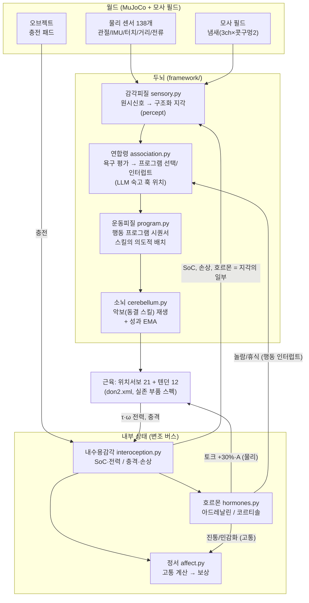
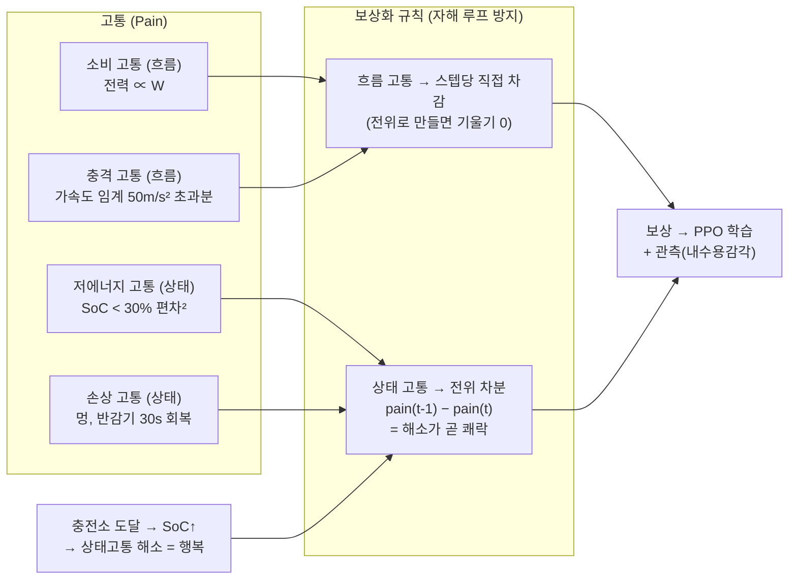
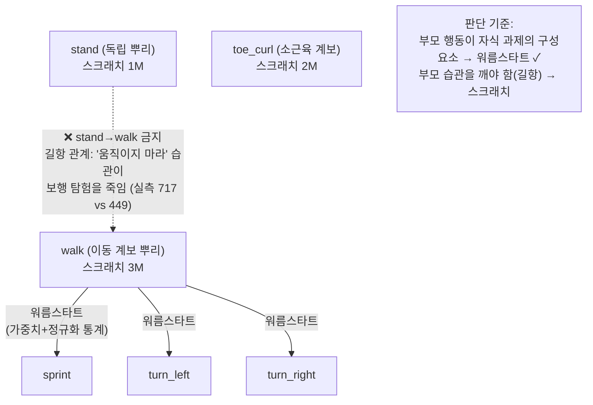
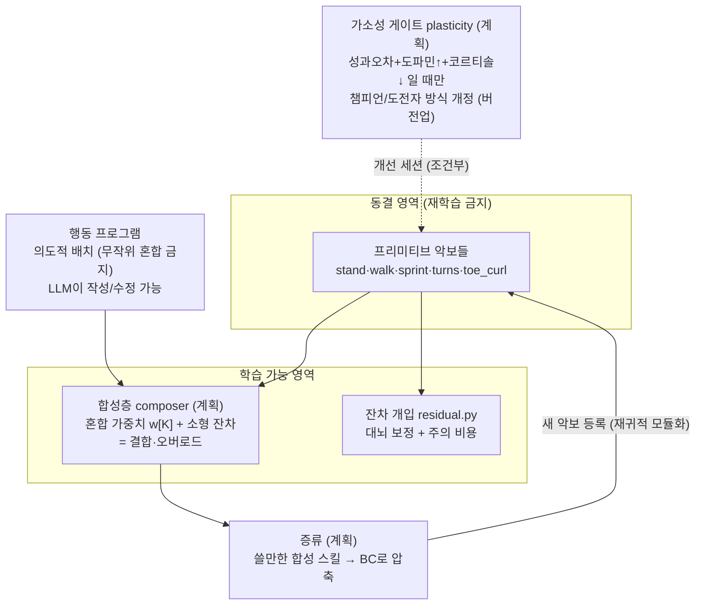
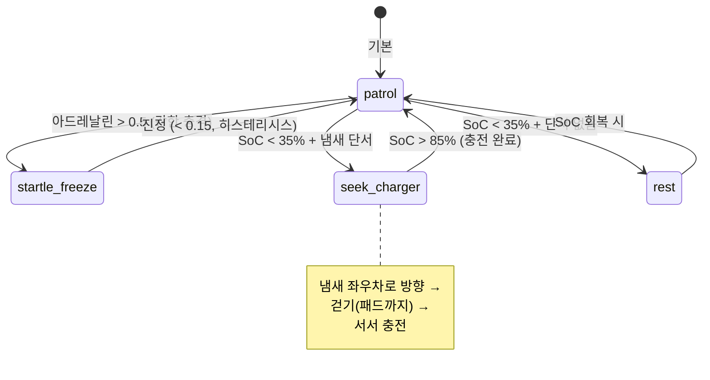

# don2 두뇌·학습 아키텍처 다이어그램

> 원본 설계 문서: [framework/DESIGN.md](../framework/DESIGN.md).
> 실선 = 구현됨(v0+), 점선 = 설계만 됨. GitHub에서 mermaid가 자동 렌더링됩니다.

## 1. 두뇌 전체 구조 (감각 → 판단 → 운동)

## 2. 고통/행복 → 보상 흐름 (항상성 경제)

## 3. 스킬 계보와 학습 규칙 (gen3b)

## 4. 운동 학습의 위계 — "학습은 악보를 쓰는 상위단만"

## 5. 실행 시나리오 예 — 욕구 주도 행동 (nursery 검증됨)

